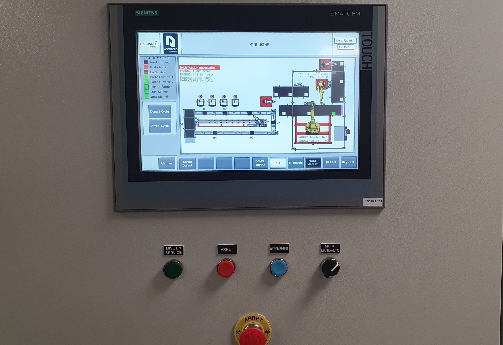

# Mise en marche

## Précaution
La Mini-Usine étant un système complexe et dangereux, la mise en marche doit se faire en toute sécurité. Veuillez donc enlever tout élément étranger. 
De préférence, un maximum de 2 personnes devraient s'occuper de la mise en marche, et sans interférences.

## Alimentation
La mise en route se fait au niveau de l'armoire principale, grâce au contacteur général, elle autorise la mise sous tension de toute la Mini-Usine. Attendez le démarrage de l'IHM et vérifiez les alarmes.

Démarrez les différents robots autour de l'Usine avec leurs boutons respectifs pour poursuivre.

Si vous ne savez pas comment, voici les présentations des différents robots.

[Allez au UR](./presentation_UR.html){: .btn .btn-purple }

[Allez au Fanuc](./presentation-fanuc.html){: .btn .btn-purple }

## Acquittement des défauts
Note : souvent les gestionnaires de la Mini-Usine prennent la sécurité d'appuyer sur le bouton d'arrêt d'urgence avant de partir la veille. Si le système ne démarre pas entièrement, veuillez vérifier le menu des boutons d'arrêt d'urgence.

Pour acquitter les défauts, un bouton d'acquittement est présent, mais veuillez lire les défauts avant de lancer le système. Il se peut qu'un défaut ne soit pas lié à la mise hors tension et qu'il y ait réellement un défaut dans l'usine. Donc, vérifiez bien d'où viennent les défauts. Une fois les défauts éliminés, le système peut être rendu armé.

## Armement
Pour armer le système, il faut que tous les appareils soient sous tension et sans défaut. On peut voir cela dans le menu I/O, Weiland Security, et dans l'onglet entrées, colonne %I16, tous les AU doivent être verts, et dans la colonne %I17, les portes doivent être vertes aussi.

Après mise en état, vous pouvez faire réarmement et puis mise en service. Si tout s'est bien passé et bien configuré, le système pneumatique s'active, et l'arrêt général se désactive. Le système ne démarre pas si un défaut l'empêche de démarrer.

## Démarrage des convoyeurs
Pour le TP sur les Fanuc, vous êtes amené à utiliser les convoyeurs. Pour démarrer les convoyeurs, rendez-vous sur l'onglet TP robot.

Appuyez sur départ cycle. Si tout se passe bien, les convoyeurs sont maintenant en route, et si toutes les conditions sont présentes, le programme des convoyeurs déplace automatiquement les boîtes. Vous pouvez vérifier le bon départ si les boutons de l'IHM sont verts.
