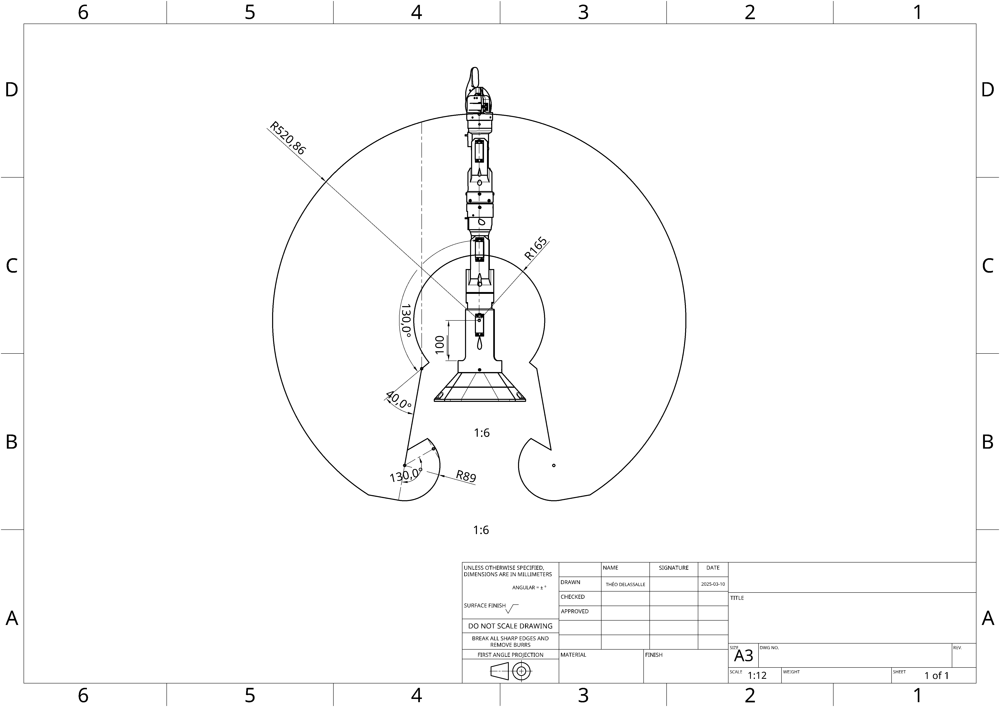

# introduction

Dans un contexte où la robotique s’impose comme un pilier de l’industrie, les entreprises cherchent à intégrer des solutions automatisées toujours plus performantes et adaptées à leurs besoins des usines 4.0. Parmi ces solutions, le suivi de trajectoire se distingue comme une fonctionnalité essentielle : dans des secteurs nécessitant précision et répétabilité, tels que l’assemblage, la logistique ou la fabrication.

# Pajet

Le Pajet est un cobot (robot collaboratif) développé par un groupe d'étudiant en I4-PAUC au sein d'UniLaSalle Amiens et est conçu pour travailler aux côtés des humains dans un environnement sécurisé. Dans le but de réaliser des TP de vision.

<embed src="photo/PosterPajet.pdf" type="application/pdf" width="100%" height="600px">

## Caractéristiques principales :

* Charge utile : 70 g, ce qui lui permet de manipuler des pièces imprimer en 3D, sans nécessiter de structure de support coûteuse.
* Portée maximale : 520 mm, adaptée pour atteindre une vaste zone de travail sans avoir à déplacer le robot ou à l’installer sur un rail mobile.
* Axes : 6 axes de mouvement, offrant une grande flexibilité et une liberté de mouvement en 3D, pour des tâches complexes et multidirectionnelles.
* Précision : ± 5 mm, garantissant des mouvements extrêmement précis, indispensables pour les applications nécessitant une haute précision, telles que l'assemblage ou le vissage.

## Avantages : 
* facile à programmer,
* flexible,
* sécurisé pour les environnements collaboratifs,
* adapté aux travaux pratique pour les étudiant. 

Il peut être mis en service sans barrière de sécurité, il suffit juste de réarmer le bouton d'arrêt d'urgence.

## Préhenseur ventouse

Le préenser ventouse est un accessoire couramment utilisé dans des applications de manipulation d’objets. Fonctionnant par aspiration, il permet de :

* Saisir des objets non poreux : Les ventouses peuvent soulever des objets tels que des plaques métalliques, du verre ou du plastique.
* Faciliter les opérations de logistique : Les ventouses sont idéales pour le picking et le placement rapide, car elles saisissent et relâchent les objets en une fraction de seconde.
* Réduire les efforts mécaniques : Comme le préhenseur ne nécessite pas de serrage mécanique, il réduit la consommation d'énergie et minimise l'usure sur le robot et les pièces manipulées.

## Préhenseur pince

Le préenseur pince est un accessoire couramment utilisé dans les applications de manipulation d’objets. Fonctionnant par serrage mécanique, il permet de :

Saisir des objets de différentes formes : 

* Contrairement aux ventouses, la pince peut attraper des objets poreux, irréguliers ou rigides, tels que des pièces usinées, des composants électroniques ou des emballages en carton.
* Assurer une prise ferme et sécurisée : Grâce à son mécanisme de serrage, la pince garantit un maintien fiable, même pour des objets lourds ou soumis à des vibrations.
* S’adapter à divers environnements : Elle est efficace aussi bien en milieu industriel que pour des tâches de précision, avec des modèles adaptés aux contraintes de force et de délicatesse.

## Utilisation du Pajet

Afin de pouvoir utiliser le Pajet, 2 options s'offre a vous, une première utilisation en console :

* Vous devrais donc branché un écrans ainsi qu'un clavier à la raspberry. Une fois fait, il vous suffiras de suivre les indication écrite sur la console,

la deuxième utilisation ce fais via l'application, pour utiliser l'application il vous faudras connecter la raspberry et l'orinateur au même wifi, une fois fais il vous suffiras d'allumer le robot pour pouvoir commencer l'utilisation.

## Noitce de montage

<embed src="photo/Notice de montage du PAJET_compressed (1).pdf" type="application/pdf" width="100%" height="600px">