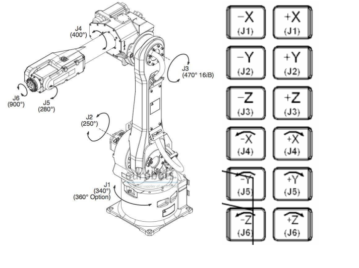
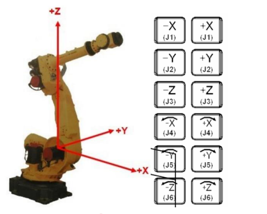
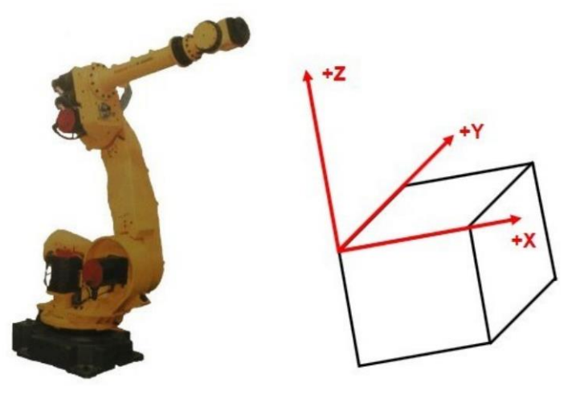
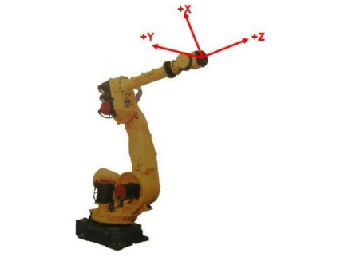

# Introduction

Dans le cadre de notre cour de robotique a Unilasalle Amiens ex-ESIEE, par groupe de 3 à 4, nous nous efforçons de découvrir à la fois le bras robotique, son programme et toutes la documentation technique. 

Le but ici est de nous permettre de nous familiariser avec les différents outils mis à disposition en laboratoire robotique. Ceci comprend donc l’étude du Manuel d’utilisation et des données techniques, l’utilisation et la coordination entre le programme sur tablette et le bras robotique. 

L’intérêt de ce cours porte sur les connaissances de base à s’imprégner en robotique et dans l’industrie automatisée. 

# Présentation de la Mini-Usine

Depuis l'inauguration de la Mini-Usine, la ligne ne cesse de s'ammeliorer, c'est pourquoi on vous présente la mini usine comment elle est a ce jour.
Plusieur sujet sont traitée sur cette linge :
* Cobotique
* Robotique
* Qualité vision
* 4.0
* sécurité

Et encore quelques autres sujets.

Aujourd'hui, la ligne possédde 2 fanucs (M-10iA et M-710iC), 2 UR (UR-10) et 1 ABB (GOFA)
ces robots sont tous reliée sur la ligne par des convoyeur et des capteurs, qui sont tous interfacée par une automate siemens dans l'amoire principale a l'entrée de la Mini-Usine.

pour allumer la Mini Usine, voici une tutoriel d'opération basique.

[Allez a la mise en opération](./Mise-En-Operation.html){: .btn .btn-purple }

# Présentation robot 6 axes

Les robots 6 axes sont des robots industriels équipés de six degrés de liberté, ce qui leur permet d'avoir une grande flexibilité dans leurs mouvements et de réaliser une large gamme de tâches complexes, ils sont très populaires dans divers secteurs industriels pour des applications nécessitant précision, souplesse et rapidité.

## Caractéristiques des robots 6 axes :

Chaque axe permet un certain mouvement (rotation ou pivot), offrant ainsi au robot une grande flexibilité pour atteindre presque n'importe quelle position dans l'espace tridimensionnel.
Les six axes sont généralement :
* Axe 1 : rotation de la base (rotation horizontale)
* Axe 2 : mouvement avant-arrière du bras
* Axe 3 : élévation ou descente du bras
* Axe 4 : rotation du poignet (rotation autour de l'axe principal du bras)
* Axe 5 : pivot du poignet (inclinaison)
* Axe 6 : rotation de l'outil ou de l'extrémité

## Précision et répétabilité :

Les robots 6 axes offrent généralement une haute précision, souvent mesurée en fractions de millimètre, ce qui permet des opérations répétitives très précises. La répétabilité des mouvements est essentielle pour des processus de fabrication nécessitant une tolérance minimale.

## Programmation et commande :

Les robots à 6 axes sont programmables et peuvent être contrôlés par différents moyens, tels que des commandes manuelles, des logiciels hors ligne (simulations), ou des interfaces HMI (Human Machine Interface).
Ils sont compatibles avec une variété de contrôleurs et peuvent être intégrés dans des systèmes d'automatisation complexes (PLC, vision industrielle, etc.).

# Présentation cobot

Un cobot (contraction de "collaborative robot" ou robot collaboratif) est un type de robot conçu pour travailler en collaboration avec les humains, dans un même espace de travail, sans nécessiter de barrières de sécurité ou de cages de protection. Contrairement aux robots industriels traditionnels qui sont souvent séparés des opérateurs pour des raisons de sécurité, les cobots sont spécifiquement développés pour être sûrs, flexibles et faciles à programmer, ce qui les rend particulièrement adaptés aux environnements de production modernes.

## Sécurité intégrée :

Les cobots sont dotés de capteurs de sécurité, de systèmes de surveillance des forces, et de technologies avancées pour détecter tout contact avec un opérateur humain. En cas de contact, ils peuvent ralentir, s'arrêter ou ajuster leur trajectoire pour éviter les blessures.

## Programmation intuitive :

Les cobots sont souvent faciles à programmer, même pour des utilisateurs non experts. Certains modèles peuvent être programmés en les "apprenant" à réaliser des tâches spécifiques en les déplaçant manuellement à travers une série de mouvements (apprentissage par démonstration).
Ils disposent souvent d’interfaces conviviales et d'outils de simulation, ce qui permet de les intégrer rapidement dans des processus industriels.

# Les modes de déplacements

## déplacements dans le repère joint

Les déplacements dans le repère joint (ou repère articulé) font référence à une méthode de contrôle du mouvement d'un robot où chaque articulation ou axe du robot est déplacé indépendamment des autres. Ce mode de déplacement est souvent utilisé en programmation et manipulation de robots à plusieurs axes (comme les robots à 6 axes), notamment pour ajuster les positions d'articulations spécifiques ou réaliser des mouvements complexes.

Un robot est constitué de plusieurs axes articulés (par exemple 6 axes pour un robot à 6 axes), et chaque axe peut être commandé individuellement.
Lorsqu'on parle de déplacement dans le repère joint, on fait référence au mouvement de chaque axe (ou joint) selon ses angles d'articulation.
Chaque articulation (axe) a un angle spécifique, généralement mesuré en degrés pour les axes rotatifs ou en millimètres pour les axes linéaires.

## déplacements dans le repère world

Les déplacements dans le repère "world" (ou repère mondial) font référence à un mode de commande des robots industriels où les mouvements sont définis par rapport à un système de coordonnées global, appelé repère cartésien ou système de coordonnées monde. Ce repère est fixe et commun à toute l'installation robotique, et il sert de référence pour situer le robot et ses mouvements dans l'espace environnant.

Le repère "world" est un système de coordonnées cartésien défini par trois axes : X, Y et Z. Il représente l'environnement global du robot, souvent avec l'origine placée à un point fixe de l'installation (comme au sol à la base du robot ou à un point de référence dans l’usine).

## déplacements dans le repère user

Les déplacements dans le repère "user" (ou repère utilisateur) permettent de définir un système de coordonnées personnalisé pour le robot. Contrairement aux repères fixes comme le repère world ou le repère tool, le repère user est créé par l'utilisateur en fonction des besoins spécifiques d'une tâche ou d'un environnement de travail particulier. Ce système de coordonnées permet d'adapter les mouvements du robot à une zone spécifique ou à un objet de référence, facilitant ainsi la programmation et l'exécution de certaines tâches.

Le repère user est défini par l'utilisateur en spécifiant un point d'origine et des orientations pour les axes X, Y et Z. Cela permet de créer un cadre de référence adapté à un objet ou à une zone de travail spécifique.

## déplacements dans le repère tool

Les déplacements dans le repère "tool" (ou repère outil) font référence à un mode de commande dans lequel les mouvements du robot sont exprimés par rapport au Tool Center Point (TCP), c’est-à-dire le point central de l'outil monté à l'extrémité du bras du robot. Ce repère est attaché à l’outil et suit ses déplacements dans l’espace, ce qui permet de programmer les mouvements du robot en fonction de la position et de l’orientation de l’outil par rapport aux objets avec lesquels il interagit.

Le repère tool est un système de coordonnées défini par l'utilisateur pour l'outil du robot, avec une origine située au Tool Center Point (TCP), généralement à l'extrémité de l'outil.
Les axes de ce repère se déplacent avec l’outil. Le mouvement du robot est donc exprimé en termes de X, Y, Z (position du TCP) et de Rx, Ry, Rz (orientation de l'outil) par rapport à l’outil lui-même, plutôt que par rapport au repère global ou aux articulations.

