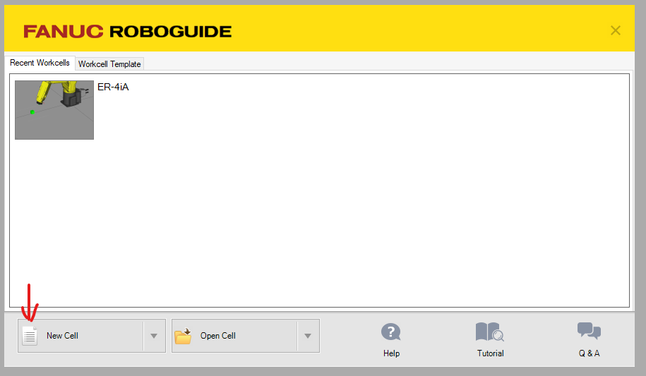
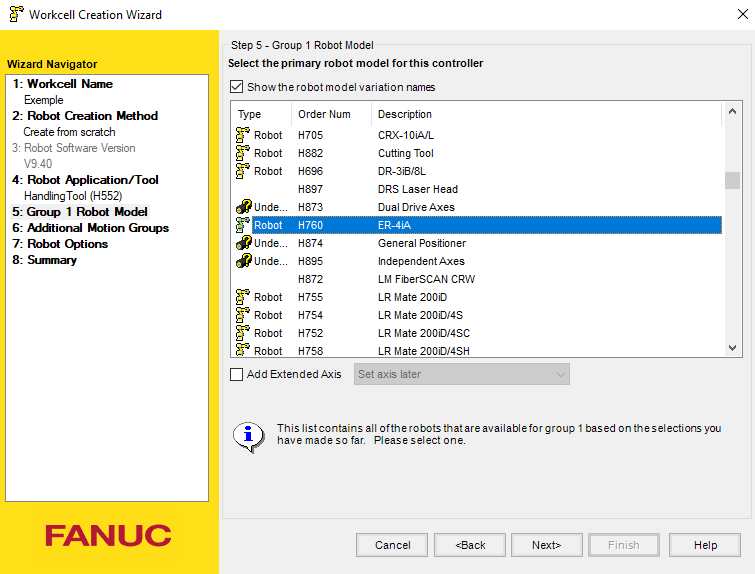
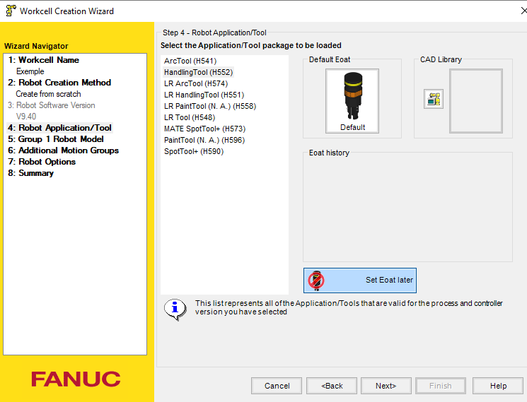
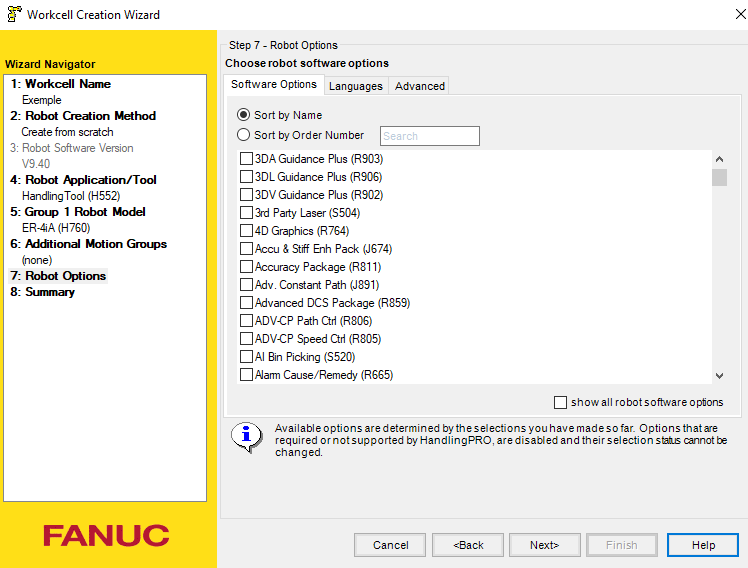

# Robotguide

Fanuc propose un logiciel de simulation et de programmation des robot executable sur windows.
L'idée est de créer un jumeaux numérique du robot pour pouvoir créer son programmation sans utiliser le robot physique.
Cela permet une conception sans danger, a distance, et de voir si la programmation est adapté dans le milieu

# Mise en route

On a commencé par exectuer le logiciel pour ensuite configurer le fichier.

Pour démonstration, nous utilisons Le fanuc ER-4iA comme exemple

On commence par créer une nouvelle cellule

On donne un nom a la cellule

On choisi le robot, pour l'exemple actuelle c'est le robot fanuc ER-4ia

Ensuite on définie l'outils, dans notre cas, nous n'avons pas l'outil proposée par le systéme 

