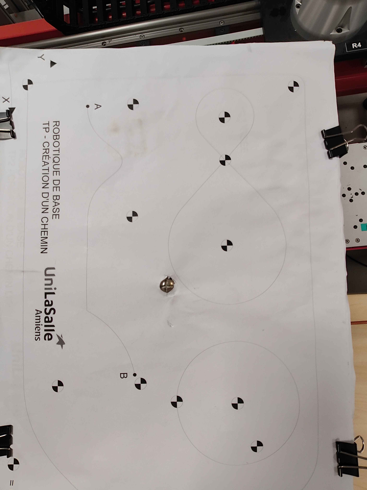
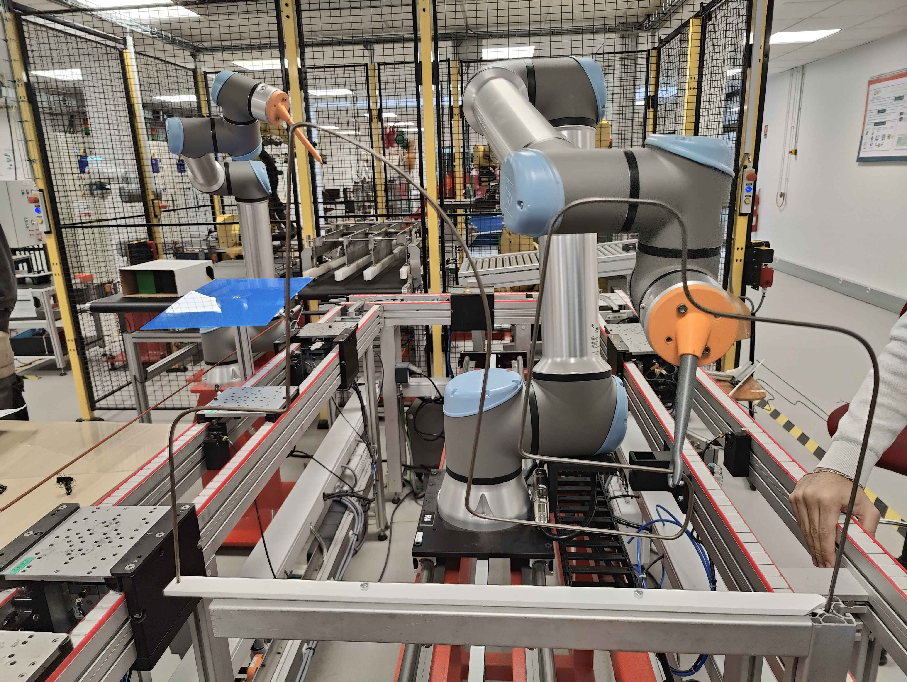

# Préparation du cobot

## Création d'un plan

Avant de programmer les déplacements du cobot, il est nécéssaire de créer le plan sur lequel l'outil va travailler. Ainsi si les mouvements effectués avec l'outil se devaient de rester identique mais à un autre endroit que celui originalement programmé, il sera uniquement nécéssaire changer les coordonnée de l'origine du plan. Les déplacements enregistré par rapport à ce plan s'addapteront automatiquement au nouveaux plan généré évitant ainsi de devoir à nouveau programmer les déplacements du cobot. 

## Création d'un repère outil

A la suite de cela, il est nécéssaire de créer le repère outil. Il permet au robot de connaitre la position et l'orientation de l'outil avec lequel il va travailler. 

# Suivi d'un tracé sur une feuille

Le chemin est le suivant:

Un programme peut-être créé via l'interface graphique pour programmer les déplacements du robot. Ainsi plusieurs points de passage peuvent être déterminer à des endroits stratégique afin de faire suivre la trajectoire souhaité à l'outil. 
On retrouve trois catégorie de déplacement possible entre les points de passage :
  - 'Déplacement P' correspond à un déplacement ou le robot va utiliser la trajectoire la plus courte en les deux points de passages  
  - 'Déplacement L' correspond à un déplacement linéaire  
  - 'Déplacement A' correspond à un déplacement en arc 

A noter que les points de passages sont placés à l'intérieur des déplacements.

Il est également possible de créer des déplacement en cercle en fonction du rayon de celui-ci. 

Pour ne pas endommager le cobot sur le long terme, il est nécéssaire de ne pas engendrer de secousse lors du déplacement de l'outil. Pour cela, il faut placer les différents points de passage à l'intérieur d'un même type de déplacements. Dans notre cas nous avons utiliser les déplacements P. Cela permet de créer les mouvements cercle précédemment cité. Ceux-ci ne sont disponible que dans les déplacements P. 

# Suivi d'une barre métallique

<video width="320" height="240" controls>
  <source src="./photo/VID20241022101134.mp4" type="video/mp4">
  Votre navigateur ne supporte pas les vidéos HTML5.
</video>

<video width="320" height="240" controls>
  <source src="./photo/VID20241022091631.mp4" type="video/mp4">
  Votre navigateur ne supporte pas les vidéos HTML5.
</video>

<video width="320" height="240" controls>
  <source src="./photo/VID20241022101124.mp4" type="video/mp4">
  Votre navigateur ne supporte pas les vidéos HTML5.
</video>
