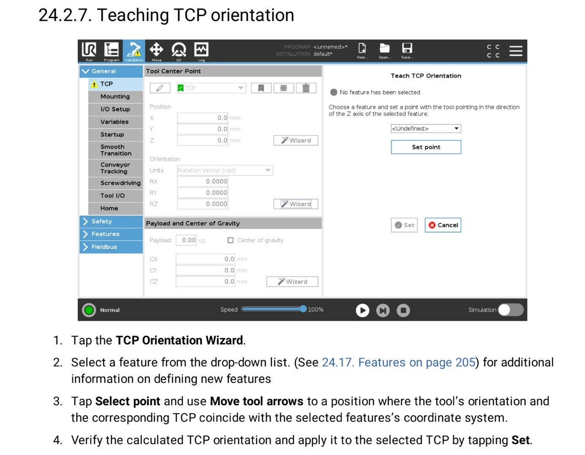

# Introduction

Dans le cadre de notre cour de robotique a Unilasalle Amiens ex-ESIEE, par groupe de 3 à 4, nous nous efforçons de découvrir à la fois le bras robotique, son programme et toutes la documentation technique.
Le but ici est de nous permettre de nous familiariser avec les différents outils mis à disposition en dans la mini usine. ceci comprend donc l’étude du Manuel d’utilisation et des données techniques, l’utilisation et la coordination entre le programme sur tablette et le bras robotique.
L’intérêt de ce cours porte sur les connaissances de base à s’imprégner en robotique et dans l’industrie automatisée.

# Universal robots

## Creation de repère outil

Afin de commencer le réglage, nous entrons dans l’onglet installation, général puis sélectionner PCO(TCP en anglais)
En premier lieu, nous allons sur position puis mesurer ( Réglage coordonnées de l’outil grâce à 3 points espacé de 120° autour du point de réglage)
En second temps, nous nous portons sur orientation pour son orientation de l’axe Z de l’outil
Après réglage de l’axe Z par rapport au plan de base(pointe de l’outil situé vers le haut), nous lançons une vérification des déplacements.

Explication II :
Installation -> fonction -> plan -> prendre un plan a modifier puis l’éditer, on place le plan selon les besoins avec le repère 3D, après validation nous pouvons le tester en sélectionnant déplacement -> fonction -> nom du plan modifiée.

## Creation de plan utilisateur 

Nous allons créer un plan d'utilisateur sur un chemin de test, ce plan aura pour but de définir les point de passage d'un outil attachée au robot.

pour ce faire, nous allons dans la rubrique xxxx, puis on fait les manipulation suivantes:

## Suivi d'un trajectoire

le chemin se fait selon le plan suivant:

## Mise en route
Quand un opérateur arrive en usine , les robots sont éteint, il faut alors les alummer grace aux contacteurs de puissances.

## Manipulation
Pour utiliser le robot, nous avons une ordinateur mobile a notre disposition, avec laquelle nous pouvons configurer le robot.

L'opérateur place ca main dans la partie basse de la commande, appui a micourse l'ordinateur de bord, puis commence a faire ses reglages.

### Déplacement simple
l'opérateur appuie a mi course l'ordinateur de bord, et appui sur reset, cela d&éverouille le déplacement grace au bouton en répere prédefinie en haut a droite de l'écran.

Il doit appuyerr sur shift pour utiliser les boutons bleu, qui a l'occurence, sont les boutons de mouvement du robot.

### Déplacement programmée
Pour crée un programme il faudra ce rendre sur le menu select puis apuier sur F2[create]
un fois le programme crée et nommé il suffira de selectioner EDIT afin d'écrire notre programme ,Il faudra dans un premier temps inserer des ligne en appuiant sur F5(insert)
Pour ajouter une ligne il faudra simplement déplacer le robot ,une fois au bonne position il faudra faire next puis F1 (point) et choisir le mouvement ,ici on a le chois entre Joint ou Linear 

### Lancement du programme 

IL faut depuis le menu select sectionner notre programme et appuies sur step puis appuier sur shift et FWR en même temps 

### Utilisation du préhenseur ventouse
menu IO > et robot puis on evite de toucher à "découplage" car ela fait tomber la pince de FANUC 710.

Il y a 2 entrée sorties sur les IO par robot

* Sur le robot 710ic, il faut changer les deux etats pour que le pince change d'état
* Sur le robot 101iA, on peux controler les deux états des 2 groupes de ventouses, c'est a dire que les 2 groupes sont activable en même temps en ventouses

### exercice
Mettre la boite dans le carton

