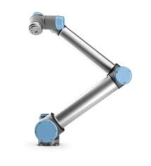

# introduction

Les Universal Robots (UR) représentent une gamme de robots collaboratifs (cobots) développés par la société danoise Universal Robots. Ces cobots sont conçus pour fonctionner en toute sécurité aux côtés des humains, dans des environnements de production variés et sans nécessiter de barrières de protection dans certaines applications. Grâce à leur programmation intuitive, leur flexibilité et leur compatibilité avec de nombreux outils et accessoires, les UR sont devenus des solutions d'automatisation prisées, particulièrement dans les petites et moyennes entreprises.

Avec une conception modulaire et une capacité à manipuler des charges de quelques kilogrammes jusqu'à plus de 16 kg, les UR couvrent un large éventail d’applications industrielles : assemblage, manipulation, soudage léger, vissage, emballage, etc. Ils sont notamment réputés pour leur facilité de programmation via une interface graphique, permettant aux opérateurs de les configurer rapidement pour de nouvelles tâches, même sans expérience en robotique.

La gamme des cobots UR inclut plusieurs modèles aux caractéristiques différentes, comme les UR-3, UR-5, UR-10 et UR-16, chacun répondant à des besoins spécifiques de portée, de charge et de précision. Leurs fonctions de sécurité avancées et leur capacité d’intégration dans divers environnements font des UR des partenaires de choix pour les entreprises cherchant à optimiser leur production avec flexibilité, sécurité et efficacité.

# Universal robots 10 

Le UR-10 est un cobot (robot collaboratif) développé par Universal Robots et est conçu pour travailler aux côtés des humains dans un environnement sécurisé.

## Caractéristiques principales :

* Charge utile : 12,5 kg, ce qui lui permet de manipuler des pièces relativement lourdes dans un cadre industriel, sans nécessiter de structure de support coûteuse.
* Portée maximale : 1 300 mm, adaptée pour atteindre une vaste zone de travail sans avoir à déplacer le robot ou à l’installer sur un rail mobile.
* Axes : 6 axes de mouvement, offrant une grande flexibilité et une liberté de mouvement en 3D, pour des tâches complexes et multidirectionnelles.
* Précision : ± 0,05 mm, garantissant des mouvements extrêmement précis, indispensables pour les applications nécessitant une haute précision, telles que l'assemblage ou le vissage.

## Applications courantes : 
* assemblage, 
* emballage,
* palettisation,
* vissage,
* soudage léger,
* etc.
## Avantages : 
* facile à programmer,
* flexible,
* sécurisé pour les environnements collaboratifs,
* adapté aux petites et moyennes entreprises. 

Il peut être mis en service sans barrière de sécurité dans certaines applications, grâce à ses fonctions de sécurité intégrées.
Ces trois robots couvrent un large éventail d'applications industrielles, allant des tâches légères et collaboratives avec l'UR-10 aux tâches plus lourdes avec les robots Fanuc.

## Préhenseur ventouse

Le préhenser ventouse est un accessoire couramment utilisé avec le UR-10 dans des applications de manipulation d’objets. Fonctionnant par aspiration, il permet de :

* Saisir des objets non poreux : Les ventouses peuvent soulever des objets tels que des plaques métalliques, du verre ou du plastique.
* Faciliter les opérations de logistique : Les ventouses sont idéales pour le picking et le placement rapide, car elles saisissent et relâchent les objets en une fraction de seconde.
* Réduire les efforts mécaniques : Comme le préhenseur ne nécessite pas de serrage mécanique, il réduit la consommation d'énergie et minimise l'usure sur le robot et les pièces manipulées.

   