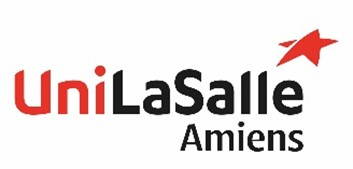

# Rapport Traitement D'images

Effectuée en 4e année à Unilasalle Amiens dans la filiére PAUC, dans le cadre du cours intitulée "Traitement d'images"

Etudiants: Théotim Testelin, Dylan Looij

---

## introduction

Le cours de traitement d'images s'interesse a sujet de la detection d'elements dans des images grace aux differentes outils et algoritmes comme le seuillage, morphologies ect ect

//a ameiliorer

Dans le cadre des TP, nous allons découvrir l'outils OpenCV, une librairie C++ et Python, qui nous permettra d'exoploiter de maniere accelerérée les algorithmes vue dans le cours magistral.
Au cours de 3 TPs, nous allons voir comment appliquer ses outils dans des applications d'analyse.

TP n°1 traite la detection d'elements specifique dans une image

[Allez au TP1](./rapportTP1.html){: .btn .btn-purple }

TP n°2 traite la detection de texte

[Allez au TP2](./rapportTP2.html){: .btn .btn-purple }

TP n°3 traite la detection d'une bille rouge sur une vidéo

[Allez au TP3](./rapportTP3.html){: .btn .btn-purple }

