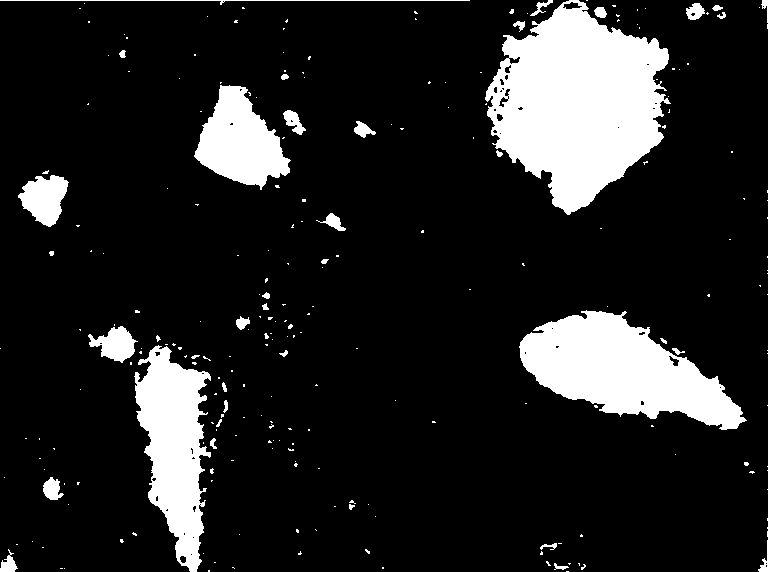

# Question 1
```python
def soldes(prix):
    a = prix * 0.8
    b = prix * 0.6 
    c = prix * 0.5
    return a,b,c

retour = soldes(130)
print(f"les prix soldés sont de {retour}")
```
```
les prix soldés sont de (104.0, 78.0, 65.0)
```
# Question 2

```python
tableau = np.array(np.random.randint(0,10,size=(3,4)))

print(tableau)
print("Collone:")
print(np.sum(tableau,axis=0)) #0 est en collone, 1 ou -1 est en ligne
print("Ligne:")
print(np.sum(tableau,axis=-1)) #0 est en collone, 1 ou -1 est en ligne
```

```
[[0 5 9 6]
 [6 8 9 6]
 [8 7 9 3]]
Collone:
[14 20 27 15]
Ligne:
[20 29 27]
```
# Question 3

La fonction WaitKey met en pause l'éxecution du programme pendant une durée déterminé en paramètre (en miliseconces). Pendant cette pause, losqu'une touche du clavier est pressée, ça retourne son code ASCII.

Lorsque le paramètre vaut 0, on met en pause indéfiniment le programme jusqu'a ce qu'une touche soit pressée.

La valeur de retour est le code ASCII de la touche pressée sinon la valeur retournée est -1.

# Question 4


L'image est un tableau de 2 dimension, avec les valeurs de niveau de gris dans les pixels respective au coordonées x y.
Le cas où l'image est stockée dans un tableau a 3 dimensions, c'est le cas ou l'image traitée est en couleur.

```python
img = cv2.imread('GE141002.bmp',cv2.IMREAD_GRAYSCALE) # img est un tableau Numpy

cv2.imshow("Beton", img)

x,y = img.shape[:2]
print(f" taille de l'image x:{x} y:{y}")

```


```
 taille de l'image x:572 y:768
```

#  Question 5

1) Opération de seuillage

2) Opération d'ouverture

3) Opération de fermeture


# Question 3.1

```python
rest, img2 = cv2.threshold(img,0,255,cv2.THRESH_BINARY_INV+cv2.THRESH_OTSU)
print(f"seuil:{rest}")
cv2.imshow("Traitee", img2)
```


```
seuil:101.0
```

# Question 3.2
```python
el_struct = cv2.getStructuringElement(cv2.MORPH_RECT,(6,6))


img3 = cv2.morphologyEx(img2,cv2.MORPH_OPEN,el_struct)

cv2.imshow("Apres Ouverture", img3)
cv2.imwrite("Q3.2.png", img3)
```


# Question 3.3

```python
img4 = cv2.morphologyEx(img3,cv2.MORPH_CLOSE,el_struct)

cv2.imshow("Apres Fermeture", img4)
```


# Question 3.4
```python
Granulats, _ = cv2.findContours(img4, cv2.RETR_EXTERNAL, cv2.CHAIN_APPROX_NONE)
nb_granulats = len(Granulats)
print(f"Nombre de Granulats :{nb_granulats}")
```
```
Nombre de Granulats : 15
```
# Question 3.5
```python
img5 =cv2.drawContours(img4, Granulats, -1, 125, 5)

cv2.imshow("Contours",img5)
```


# Question 3.6 
```python
air_total = 0
for i, contour in enumerate(Granulats):
    air = cv2.contourArea(contour)
    air_total += air
    print(f"Granulat {i+1}: Air en Pixel = {air}")
    
air_moyen = air_total / len(contour) if Granulats else 0
print(f"Air moyen des granulats:{air_moyen} pixels")
```

```
Granulat 1: Air en Pixel = 9.5
Granulat 2: Air en Pixel = 147.0
Granulat 3: Air en Pixel = 234.0
Granulat 4: Air en Pixel = 9407.5
Granulat 5: Air en Pixel = 879.0
Granulat 6: Air en Pixel = 67.5
Granulat 7: Air en Pixel = 14230.0
Granulat 8: Air en Pixel = 130.5
Granulat 9: Air en Pixel = 1566.0
Granulat 10: Air en Pixel = 129.5
Granulat 11: Air en Pixel = 163.0
Granulat 12: Air en Pixel = 5608.5
Granulat 13: Air en Pixel = 118.0
Granulat 14: Air en Pixel = 21.0
Granulat 15: Air en Pixel = 24543.5
Air moyen des granulats:3816.9666666666667 pixels
```
# Question 3.7

```python
img6 = cv2.cvtColor(img5,cv2.COLOR_GRAY2BGR)
air_total = 0
for i, contour in enumerate(Granulats):
    air = cv2.contourArea(contour)
    air_total += air
    print(f"Granulat {i+1}: Air en Pixel = {air}")
    #rectangle englobant chaque Granulats
    x,y,w,h = cv2.boundingRect(contour)

    #position du texte
    text_x = x+w // 2
    text_y = y+h // 2
    #ecriture du numéro
    cv2.putText(img6,str(i+1), (text_x,text_y),cv2.FONT_HERSHEY_DUPLEX, 0.5, (0,0,255))

        
air_moyen = air_total / len(Granulats)
print(f"Air moyen des granulats:{air_moyen} pixels")

cv2.imshow("Contours",img6)
cv2.imwrite("Q3.7.png", img6)
```

