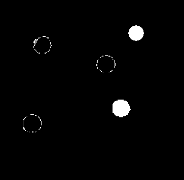
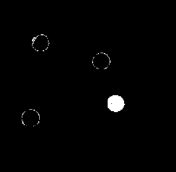

# TP3 

## Introduction

OpenCV ne permet pas seulement de traiter des images fixe, mais aussi une suite d'images, c'est a dire une vidéo, et c'est le sujet de ce TP3.
Nous avons 2 fichiers, un image, et un video, et en construisant l'alorgithme de traitement sur un image fixe
nous pouvons en faire une simple fonction pour traiter les images de la video un a un.

## Travail sur l'image fixe

Comme dans les 2 TP précedents, nous allons recuperer l'image avec 

```python
Image_Bille = cv2.imread("boules.png")
```
### Question 10

L'attribut shape de Numpy permet de recuperer les dimension de l'images, ainsi que le nombre de caneaux qui definisent le couleur


```python
taille_x, taille_y, nbr_canneaux = np.shape(Image_Bille)

print(f'Taille de x : {taille_x}')
print(f'Taille de y : {taille_y}')
print(f'Taille de canneaux : {nbr_canneaux}')

```
output:
```
Taille de x : 
Taille de y :
Taille de canneaux : 
```

Pour les tailles, cela va de soit que cela represente les different taille de x y, soit la longeur et largeur, pour le canneaux, c'est plus compliquée, elle correspond au different composant pour répresenter un pixel en couleur, si il y une seule canal c'est souvent du noir et blanc, si il y en a plusieur on peux avoir plusieur type de composants, nottament le RGB, HSV etc...


### Question 11



On vois bien que 2 billes sont visible sur cette images, c'est parceque le couleur du point blanc est composée d'une composante rouge très importante (il ne serais pas inimaginable que la valeur du rouge ici est 255)

la démarche est donc inéfficace, et il faut faire faire une conversion en HSV.


###  Question 12

L'essai de travaile sur les 3 composantes est vouée a l'echec car 3 paramétres sont bien trop complexe pour retrouver la couleur rouge exacte dont on a besoin, de plus ces parametre vont correspondre a d'autre couleurs dépandant des intervalles de couleurs choisi, notament le rouge orangé et je rouge rose.


### Question 13

```python
rouge_inferieur = np.array([0,50,50])
rouge_superieur = np.array([I,255,255])

rouge_inferieur_2 = np.array([180-I,50,50])
rouge_superieur_2 = np.array([180,255,255])


Masque_1 = cv2.inRange(Image_Bille_HSV,rouge_inferieur,rouge_superieur)
Masque_2 = cv2.inRange(Image_Bille_HSV,rouge_inferieur_2,rouge_superieur_2)

Masque_totale = cv2.bitwise_or(Masque_1,Masque_2)

cv2.imshow('Rouge nouveau',Masque_totale)

```



le résultat n'est pas satisfaisant car on a toujours les contour des autres billes


### Question 14

```python
el_struct = cv2.getStructuringElement(cv2.MORPH_RECT,(6,6))
Ouverture = cv2.morphologyEx(Masque_totale,cv2.MORPH_OPEN,el_struct)
cv2.imshow('Ouverture',Ouverture)
Fermeture = cv2.morphologyEx(Ouverture,cv2.MORPH_CLOSE, el_struct)
cv2.imshow('Fermeture',Fermeture)

```


Nous avons utilisé l'ouverture puis fermeture de l'image pour ammeiliorer la qualité de ce dernier.
Comme vous pouvez le remarquer, nous avons enfin isolée la bille, sans artéfacts restantes dans le rendu finale

### Question 15

Nous pouvons utiliser la méthode tracking pour optimiser le code, elle repose sur le principe que la bille ne se téleporte pas et sa postition lors de la prochaine frame est toujour dans la proximité de son ancien frame,  on réduit alors notre zone de recherche et traitement pour reduire la compléxité d'espace ainsi que le temps de calcul, on peux ensuite utiliser une reconnaisance plus simple, nottament en utilisant le filtre de kalman.


# Conlusion


Ce tp nous a servi de s'approprier les base d'Opencv tout en traitant des problématique réels