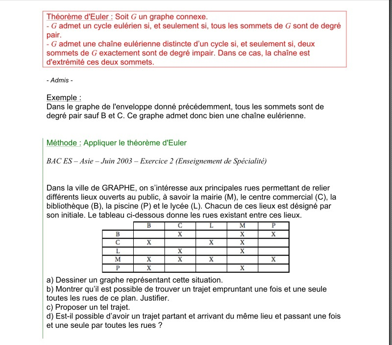

# Exercice de Cours

# Correction

b) C'est tout a fait possible puisque D'apres le theoréme d'euler, si il existe deux sommets de degré impair donc on peux toruver une chaine eulienne quie commence par B et C

c) Par exemple: C>L>M>C>B>P>M

d) D'après le théoréme d'euler , un graphe admet un cycle eulerien si et seulement si tout les sommet de graphes sont paires

   

