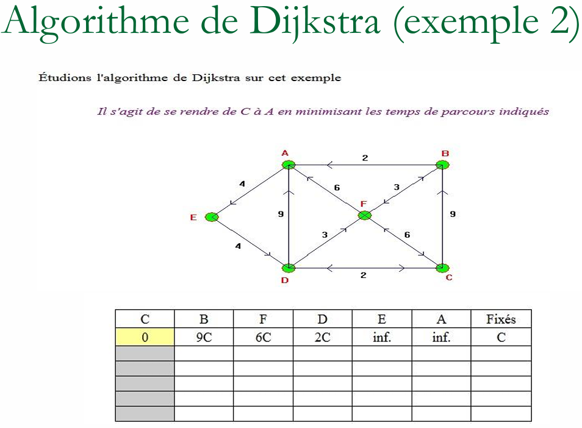

# Exercice de Cours

# Correction

| c   | b    | f    | d    | e    | a    | ou fixe sommet |
| --- | ---- | ---- | ---- | ---- | ---- | -------------- |
| 0   | \inf | \inf | \inf | \inf | \inf | On garde c     |
| /   | 9C   | 6C   | 2C   | \inf | \inf | On garde d     |
| /   | \inf | 5d   | /    | \inf | 11d  | On garde f     |
| /   | 8f   | /    | /    | \inf | 11f  | On garde B     |
| /   | /    | /    | /    | \inf | 10B  | On garde a     |

   
Donc le chemin inverse est C-> D-> F-> B-> A

