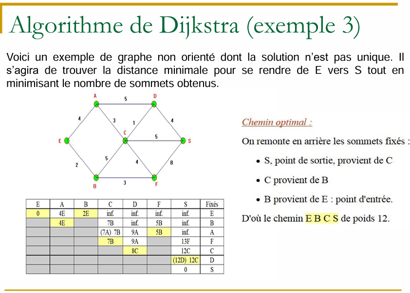

# Exercice de Cours

# Correction

| e   | a   | b   | c     | d    | f    | s       | Fixés |
| --- | --- | --- | ----- | ---- | ---- | ------- | ----- |
| 0   | 4E  | 2E  | \inf  | \inf | \inf | \inf    | E     |
| /   | 4E  | /   | 7B    | \inf | 5B   | \inf    | B     |
| /   | /   | 5d  | 7A 7B | 9A   | 5B   | \inf    | A     |
| /   | /   | /   | /     | 9A   | /    | 13F     | F     |
| /   | /   | /   | /     | 8C   | /    | 12C     | C     |
| /   | /   | /   | /     | /    | /    | 12D 12C | D     |
| /   | /   | /   | /     | /    | /    | 0       | S     |

   
Donc le chemin inverse est C-> D-> F-> B-> A

