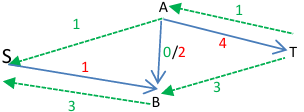

<!--title: Recherche operationel -->

# Cours recherche opérationelle


{: .note }
Premier cours en markdown

Recherche des solution des problèmes graces a l'informatique, en trouvant la solution optimale.

Donc il faut des algorithmes de selection de solution.


1) G doit etre connexe (Diap 20)

2) hbve de sommets de degreé impair doit être egale à 0 ou 2
  * a ->3
  * b ->3
  * c ->3
  * d ->5

sont les nombres de sommet de degré impair = 4

* a' ->4
* b' ->3
* c' ->4
* d'-> 5


## définitions:

{: .def-title}
>graphe complet
>
>un graphe est complet si quelsque soient deux sommets distincts, il existe un arc (ou une arête) les reliant dans un sens ou dans l'autre (lorsqu’on a un graphe orienté), ne contient pas de boucle.


{: .def-title}
>distance
>
>On appelle distance entre deux sommets la longeur de la plus petite chaïne les reliant

{: .def-title}
>diamètre
>
>On appelle diamètre d'un graphe la plus longue des distances entre deux sommets

{: .def-title}
>sous graphe
>
>le graphe G' est une sous grpahe de G si l'ensemble des sommets de G' est inclus dans l'ensemble des sommets de G, et si l'ensemble des arcs de G' est égal au sous-ensemble des arcs de G reliant entre 
eux tous les sommets de G'; on a donc retiré de G certains sommets, et tous les arcs adjacents à ces sommets.

{: .def-title}
>Chemin
>
>Suite d'arcs telle que l'extrémité terminale d'un arc coïncide avec l'extremité intiale de l'arc suivant

{: .def-title}
>Théorème d'Euler
>
>"On peut se "promener" dans le graphe en passant une fois et une seule par chaque arête si et seulement si le nombre de sommets extrémités d'un nombre impair d'arêtes est 0 ou 2." 


{: .def-title}
>Cycle eulerien
>
>Si et seulement si tout ses sommets ont un degré pair dans le cas non orienté , ou si chque sommet d'un grpahe orienté a un degré entrant égal à son degré sortant

{: .def-title}
>Chaine eulerienenne
>
>Si on peux passer pas toute les arretes une seule fois et de faire tout les chemins


Lorsque le graphe est non orienté, la mtircie associée est symétrique par rappot à la diagonale.

Lorsqu'il n'y a pas de boucle, il n'y a que des zéros sur la diagonale.

graphe non orientée: Arrête - chaine(chaine eulerienne) cycle
graphe orientée: Arc -chemin - circuit, (Chemin Hamiltoninien)(sommet)

diapo 36
Pour décrire des phénomènes aléatoires se répétant, on peu tutiliser un grpahe et la matirce qui lui est associéee On parle alors de graphe probabiliste ( car en lien avec des calculs de probabilités )

## l'algorithme de dijkstra

Le porblème consite à chercher le plus court chemin entre 
1) un sommet de départ donné et un sommet d'arrivée donné
2) un sommet et tous les autres
3) n sommmets de départ et m sommmets d'arrivée
  
Méthode de Dijkstra

```psoeudo
Un graphe G
un Sommet de départ s
    x-> poid(x)
    x-> y(x,y)
    S = l'ensemble des sommmets du graphe
    π <- ∅

début 
    tant que π =/ S
      choisir un sommet n'appartenent pas a π de poids minimum
      π <- π u {x}
      pour tout voisin y de x n'appartenant pas à π
          si poids(x)+ valeur(x y)< poids (y)
          alors     poids (y)<- poids (x)+valeur (x y)
                    mémoriser en y que l'on vient de x
          fin si
      fin pour tout
    fin tant que
```

On part de S vers b

| sommets | s   | a    | b    | c    | d    | ou fixe sommet |
| ------- | --- | ---- | ---- | ---- | ---- | -------------- |
| debut   | 0   | \inf | \inf | \inf | \inf | on garde S     |
| étape 1 | /   | 8(s) | \inf | \inf | 2(s) | on garde d     |
| étape 2 | /   | 6(d) | \inf | 4(d) | /    | on garde c     |
| étape 3 | /   | 5(c) | 6(c) | /    | /    | on garde a     |
| étape 4 | /   | /    | 6(c) | /    | /    | on garde b     |

d'ou les chemins:
- de s vers d; direct de coût 2
- de s vers c; de s vers d puis de d vers c (total 4)
- de s vers b; de s vers d puis de d veers c puis de c vers b (total 6)
- de s vers a; de s vers d puis de d vers c puis de c vers a (total 5) 

 # Méthode d'odonnancement des tâches: MPM

{: .def-title}
>MPM: méthodes des potentiels Metra
>
>Il s'agit de savoir planifier l'éxecution de tâches qui ont une certaine durée, et qui ont entre elles des relations d'antériorité ( par exemple, dans les révision qu'il faut faire avant de passer le bac, il y a des chapitres qu'il faut revoir avant d'autres)

a partir des taches, on crée un graphe qui permet de voir les liens entre les differents taches, et dans quelle heures il faut les faire


Ensuite on crée une graphe avec des sommets orientée, avec 2 taches ficitves qui sont la tache fin et début
(tout les chemin doivent menner de début jusqu'a la fin)


| taches         |                            |
| -------------- | -------------------------- |
| date de pontan | date de debut au plus tard |


{: .def-title}
>propriété
>
>La date de début au plus tôt d'un réseau MPM correspond à la date à laquelle une tâche peut commencer au plus tôt. 

Formule:

Date de début au plus tôt d'une tache T = Date de début au plus tôt du prédécesseur de la tâche T + durée du prédécesseur de la tache T

OU

date de début au plus tôt d'une tache T = max(Dates de début au plus tôt des prédécesseurs de la tache T + durée des prédécesseurs de T)


Dates <<au plus tôt>>

On commence du début, et on ajoute la durée de i-1 en dessous du tableau, 

quand deux chemins se rejoingent, on choisi la durée la plus longe entre les 3 chemins


Dates <<au plus tard

La date de fin au plus tard est égale au plus tôt

pour compléter le tableau, il faut partir de la fin pour aller au début, et puis quand des chemins se relient, on prend la valeur la plus petite


Une tache crituque est une tâche ou la date au plus tôt est = a la date au plus tard
C'est a dire, la marge = 0


{: .def-title}
> Marge totale
> 
> retard maximum que peut avoir une tâches sans retarder la fin du projet (les tâches critiques n'ont pas de marge). On l'obtient en calculant ti* -ti


Diagramme de GANTT
Representer le déroulement des taches de maniere Graphique


{: .def-title}
>problèmes de flots
>
>c'est un // a remplir


On les trouves dans les transport, Production, télécommunications, affectation de personnel

Dans le tranport, on retrouve le tranposrt de marchandises, que ca soit routier, ferroviaires, éléctrique, canalisations

Dans le production, c'est l'ordonnancement de la fabrication de produits, et le Flot de produits dans un système de stocks

Dans le télécommunications, c'est plustôt la conception et dimenssionsement de l'architecture, et les flots d'information dans les réseaux de télécommunication

Puis dans les affectation de personnel
Pour les vols, et condcteurs a des véhicules


Il existe un réseau de transport R


Ce qui est soulingé est le flux

| capacité | flux |
| -------- | ---- |
| 10       | 9    |


FLux réalise a ble

1) 0<= Xij <=Cij
   
2) Pour tout i, i different de: source ;puits;
   
3) Somme de flux entrant = Somme de flux sortant (loi des noeuds)

Soit V valeur du flot qu'on cherche à Maximiser
Verfifier que la loi des noeuds est verfiée


Un flot X est maximal si 
1) X est réalisable

2) il Maximise la valeur du flot v

Le problème du flot maximal est de trouver un flot de valeur maximale ou flot max


{: .def-title}
>Un chemin améliorant
>
>Un chemin améliorant P est un chemin de s à t dans le réseau résiduel 

{: .def-title}
>La capacité résiduelle 
>
>La capacité résiduelle d’un chemin améliorant P est         
δ(P) =  min {rij : (i,j) ⋲ P}.


Algorithme de Ford Fulkerson:

1) Réseau de transport

2) trouver touts les chemins allant de s vers t
   
3) Calculer les capacité résiduelles de tous les chemins trouve
   
4) CHoisir un des chemins trouès en prcsiant la capacité résiduelle
   
5) Soustraire le graphe residuel correspondant


SAT = ∆1 = Min {1,5} = 1

SBT = ∆2 = Min {3,4} = 3

SABT = ∆3 = Min {1,2,3} = 1





### Calcul des marges d'une tache dans un réseau MPM

#### 1- la marge totale
{: .def-title}
> La marge totale
>
> La date

{: .def-title}
> La marge Libre d'une tache T
>
> La date de début au plus tôt du successeur de la tache T- Durée de la tache T - Date au plus tôt de la tache T.


{: .def-title}
> Autre Formule
>
> Marge libre d'une tache T = min(dates de début au plus tôt des successeurs de la tache T – date de début au plus tôt de la tache T – durée de la tache T)


### chaînes de markov

{: .def-title}
>Processus aléatoires (porcesssus stochastique)
>
>est une succession d'épreuces aléatoires où les issues (états possible) - qu'on suppose en nombre fini sont toujour les mêmes , mais où la répartition de probabilité évolue.

{: .def-title}
>Chaîne de Markov
>
>Processus aléatoire où la répartition de probabilité évolue selon des probabilités de transistion constantes.

> le futur dépend du présent, mais pas du passé


On peu treprésenter une chaîne de markov comme une marche (promenade) aléatoire sur un graphe:
* les sommets sont les états possibiles
* les flèches portent les probabilités de transistions

{: .hint}
>Pour toutes les flèches partant d'un même sommet, la somme des coeffiscients vaut 1


Qprès avoir ordonné les états, on peut lui associer une matrice de transistion T:
Les coefficients de T sont les probabilités de transistion, avec la convention suivante:
* l'indice de colonne indique l'état de départ
* L'indice de ligne indique l'état d'arrivée
cette convention, qui n'est pas la plus usuelle , permettrea d'utiliser des matrices comonnes pour les répartitions de probabilité.

{: .hint}
>Une matrice de transistion a tous ses coefficients positif etn de somme 1 pour chaque colonne


Si Pn est la matice colonnne indiquant la répartition de probabilité à l'étape n, le théorème des probabilités totales pemet d'écrire Pn+1 = T* Pn
on en déduit Pn = T^N P0

Si on dispose d'une formule explicite pour T^N, on peut en déduire une formule explicite pour Pn.

remarque, Pn+k = T^k* Pn
donc T^k est la matrice de transistion/ transfert pour k étapes

Si T admet une puissance sans aucun coefficient nul, alors:
* il existe une répartition de probabilité P stable, c'est-à-dire telle que TP=P, et un seule;
* La suite (Pn) converge vers P.

